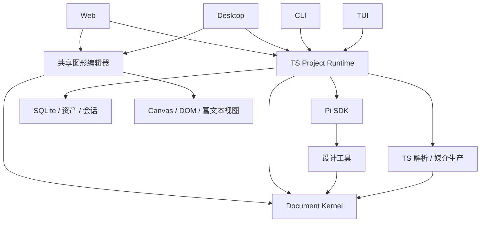

# OEYdesign 全 TypeScript 架构

> 当前采用：D 路线，2026-09-12。状态截至 2026-09-20：R1 Windows 开发基线已验证；R2 Deck 编辑/导出与 R3 产品 Pi 接入已实现，最终验收见[本轮记录](spec/r2-r3-validation.md)。完整目标架构及跨平台干净安装仍按 R4–R7 推进。
> 依据：[PRD](prd.md)、[ADR-0006](adr/0006-full-typescript-design-platform.md)。本文替代旧分层架构。

## 1. 核心决策

产品围绕**可编辑文档与统一操作核心**构建。人、agent、CLI 和 TUI 都通过相同命令改变项目；所有画布、属性面板、预览和导出从已提交状态派生。

Pi 公共 SDK 直接在 TS runtime 中承担模型会话和工具循环。没有 Python sidecar，没有包裹旧 Control Plane 的兼容层，没有同时维护两套 agent 引擎的产品方案。全 TS 是目标运行路径，旧代码只服务于参考与数据导入；CSS、HTML、JSON 等声明性资源照常使用。

## 2. 组件与依赖



图中的工具操作通过 runtime 的统一提交入口调用 Kernel，不直接写存储。编辑器对 Kernel 的调用可用于本地手势预演，权威提交仍由项目 runtime 完成。

## 3. 代码组织

目标目录与当前实现状态：

```text
apps/
  web/                  # Web host、设计对话和 Deck 工作台；Web 文档生产在 R4
  desktop/              # Electron 主进程 / preload / 共享图形界面（待 R6）
  cli/                  # 项目、文档、素材、导出、agent 与 owner 接续；JSON 输出
  tui/                  # 终端交互（待 R6）
packages/
  document/             # Deck 模型、富文本、图片/表格/图表、命令、校验、反向操作
  runtime/              # SQLite、统一历史、可靠输入、Pi AgentSession、素材与工具服务
  editor/               # Konva 几何交互、ProseMirror 富文本与共享属性/图层控件
  media/                # Deck SVG/PNG/PDF 与原生 PPTX；实际 Office 验证脚本
```

R1 已在 Node 24.21.0 与 Electron 44.3.0 utility process 上完成 Windows x64 宿主验证。R2/R3 的当前运行路径包含 Deck 编辑、导出和 Pi 产品会话，既可由 CLI 独立使用，也可由 Web owner 提供服务。实际兼容模型完成三页生成、人工修改接续、提问重启和图片链路验证；原生 provider 验证尚待授权。Deck 的 Chrome 4/4 与完整视觉回归已通过。TUI、Desktop 与其他媒介能力按后续阶段推进，不调用旧 Python 填补范围。

起步采用 npm workspaces、TS ESM；按目录组织子模块，不预先拆出几十个包。测试与代码相邻。公共命令和文档类型由 document/runtime 的公开入口提供，不维护重复 schema 仓库。

依赖规则：

- document 不导入 React、DOM、Electron、Pi、HTTP 或 SQLite；富文本模型/转换库可使用无界面部分。
- runtime 不依赖任何 app，也不依赖 editor。
- media 的无头解析/导出入口不依赖 editor 或浏览器组件挂载。
- editor 不含凭据、模型调用或私有存储访问。
- apps 只组合核心和对应 I/O，不各自实现业务规则。
- Web、Desktop 的宿主协议与直接调用使用同一命令/事件结构；协议不是新业务真源。

## 4. 文档模型

共享的是身份、资产引用、设计决定、编辑操作和事务；Web、Deck、Doc 使用有区别的 schema：

- Deck：固定页面、形状/文字/图片/表格/图表对象、层级、变换与主题。
- Web：页面、组件/DOM 语义、流式/flex/grid/定位布局、断点、样式与受管代码模块。
- Doc：富文本块、章节、列表/表格、样式、分页参数、行内/浮动图形。

结构化编辑模型在开始创作时就存在；不再等选定方向后才补结构。这个变化使持续拖拽和人机编辑成为原生能力，而不是事后从截图识别对象。

CSS、HTML、PPTX、DOCX 与 Canvas 节点均是表示或投影，不能与文档模型各自独立修改。外部代码与复杂导入对象的边界见 [编辑规范](spec/editor-document-spec.md)。

## 5. 人机同步

统一提交入口处理命令 ID、actor、目标、基准修订、前置条件与命令批次。成功后在一个事务中保存新的文档、操作、必要的反向数据和事件。

用户拖拽时在本地显示瞬时预演，放手后提交一次命令。Agent 可分批提交可见进度，每批使用当前基准；新的人工操作会进入下一轮模型上下文。

无关属性的陈旧操作可以经过校验后重放到当前文档；同一属性、删除子树、容器关系等冲突不得静默覆盖。冲突返回具体目标，agent 重新读取并调整。第一版是单用户 + agent + 多客户端，不建设多人 CRDT 服务。

## 6. Runtime 与客户端

每个项目同时只有一个权威写入 runtime。CLI 可直接启动它；Web host、Desktop utility process 和 TUI 也能组合它。已有 owner 时连接该 owner 或返回明确占用结果，不允许多个进程绕过命令直接写同一项目。

持久对象包括项目、文档、输入、操作、版本、素材和会话关联。Pi 负责模型上下文，不负责文档版本。浏览器选择、缩放、光标等属于视图状态，不触发设计修订。

运行无模型的编辑命令不需要 API key；CLI/TUI 也不需要 Web 服务。查看/导出可以按需启动无头 Chromium，不等于运行图形客户端。

## 7. 采用的技术基线

| 部分 | 基线与边界 |
|---|---|
| 一方代码 | TypeScript、ESM、npm workspaces |
| Node | Node 24.21.0 Windows x64 binary 与 `node:sqlite` 内存读写已验证；跨平台干净安装留到 R7 |
| Agent | Pi 本地 SDK；已核对 0.85.1 为当前研究基线，不使用实验 server/client 接口 |
| 图形 UI | React + Vite；旧 UI 可择取组件，不保留旧 run/store 语义 |
| 固定画布 | React-Konva/Konva 的命中、变换与绘制；文档模型由 OEY 管理 |
| Web 编辑 | 实际 DOM 布局与编辑 overlay；同一文档投影支持源码生产 |
| 富文本 | ProseMirror schema/transform 与视图，用于 Doc 和文字对象 |
| Desktop | Electron，窗口/preload 与核心运行进程分离 |
| TUI | pi-tui 作为终端绘制基线，业务读取共享 runtime |
| Web transport | Fastify HTTP + SSE；不进入 document 核心 |
| 持久化 | SQLite，TS 驱动；Node 24.21.0 与 Electron 44.3.0 utilityProcess 内嵌 Node 24.20.0 均已通过 `node:sqlite` 探测 |
| 媒介 | PptxGenJS、docx、Playwright；PDF.js、OOXML ZIP/XML、WASM OCR 等 TS 调用链 |

技术基线是实现起点，尚不表示依赖已安装或整合成功。具体库不满足能力时可以在 TS 范围内更换，不得据此削减直接编辑或恢复 Python 依赖。

SQLite 驱动只能在 storage 模块内使用。Electron 44.3.0 utility process 已通过相同 `node:sqlite` 内存读写探测；完整 Desktop 集成和打包仍待 R6/R7，不自行实现另一套存储逻辑。

## 8. 解析、生成与交付

media 负责所有新解析和导出，直接读取不可变文档快照及资产。所有路径为 TS；旧 Python 输出可作为对比样本，不参与新请求。

Web 生产支持静态和受管 React/Vite 应用。Deck 按原生对象生成 PPTX；Doc 按结构与样式生成 DOCX。真实导出物必须重新检查，编辑器画布不能证明 PowerPoint/Word 的最终排版一致。

参考资料的文本、结构、样式和缩略图分别保存，素材读取与项目语义不依赖某个模型 provider。

## 9. 运行与发布边界

全 TS 不要求重新实现 Chromium、SQLite 或字体引擎；这些第三方原生/WASM 依赖必须可随产品分发。新安装、构建、运行、迁移与导出不能要求用户安装 Python。

默认本地单用户。业务 API/IPC 不暴露给产物预览；项目文档写入与模型凭据留在 runtime。构建用户代码使用受管子进程与明确工作目录。公开部署/外发按用户授权处理，普通编辑不引入额外审批。

不把 Windows 专用 AppContainer 作为跨平台核心前提。操作系统差异只在宿主文件、进程、字体与窗口边界处理。

## 10. 依据与限制

- [Pi SDK](https://github.com/earendil-works/pi/blob/v0.85.1/packages/coding-agent/docs/sdk.md)：嵌入会话与自定义工具。
- [Konva Transformer](https://konvajs.org/docs/react/Transformer.html)：几何操作基础；不能替代文档、历史或导出。
- [ProseMirror Guide](https://prosemirror.net/docs/guide/)：schema、transaction 与 transform。
- [Electron 进程模型](https://www.electronjs.org/docs/latest/tutorial/process-model)：共享界面与独立核心运行。
- [Node 发布状态](https://nodejs.org/en/about/previous-releases)：选择 LTS 基线。

“一次彻底迁移”解决语言和核心职责问题，不保证以后永不升级 schema 或依赖。设计选择已明确，未知项见实施计划，不能用旧架构兼容层掩盖尚未完成的新能力。
