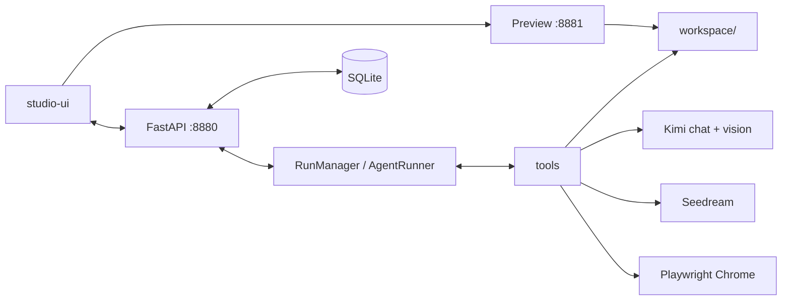

# OEYdesign Studio

Claude Design 风格的交互式设计 agent：左侧持久对话，右侧实时画布。一次 run 产出可交付的 **Web / Deck（PPT）/ Doc**，需要配图时走 Seedream，写完后自动截图做视觉审查。Run 可中断，完成会打版本，导出 zip / html / pdf / pptx / docx / md。

共享契约（API、事件、工具、工作区）：[contract.md](./contract.md)。Studio **不依赖** Phase 6 受控流水线。

## 快速开始

```powershell
.\start-studio.ps1
```

- API + UI：<http://127.0.0.1:8880>
- 预览源（仅 workspace）：<http://127.0.0.1:8881>
- 脚本会在缺少 `studio-ui/dist` 时先 `npm run build`。

等价命令：

```powershell
$env:PYTHONPATH = "src"
python -m oeydesign.studio --port 8880 --preview-port 8881 --data-root data/studio
```

仓库根 `.env`（utf-8-sig）提供默认密钥，Settings 抽屉可覆盖（密钥只写不回读）：

| 用途 | 键 |
|---|---|
| LLM | `API_KEY` `BASE_URL` `MODEL` |
| 生图 | `ARK_API_KEY` `ARK_BASE_URL` `ARK_MODEL_ID` |

密钥落在 `data/studio/secrets.json`，**不会**写入 SQLite 的 `run_events` 或日志。

本机 Hyper-V 排除了端口 **8728–8827**，不要用 8780/8781。

## Run 如何工作

模型按这个顺序干活（见 system prompt）：

1. `update_plan` — 3–7 步计划
2. `set_artifact` — 声明 kind / title / entry，写入 `artifact.json`
3. `write_file` / `edit_file` — 写真实文件
4. `render_preview` — Playwright 截图，把图贴回对话
5. 自动视觉审查（`agent.visual_review`）：终稿截图 + rubric；`REPAIR` 时最多 `auto_repair_rounds` 轮修补
6. 用用户语言写短总结，打版本快照

**`ask_user` / `NEEDS_INPUT`**：信息不够时弹出表单；`POST /api/projects/{id}/runs/{run_id}/answer` 把答案追加为用户消息并开新 run。

**Stop / 中断**：聊天栏 Stop 调用 `POST .../runs/{run_id}/cancel` → `CANCELLED`，流关闭，未完成的 tool 补 `{"cancelled": true}`。运行中再发一条消息会先取消当前 run，再开新 run。

## 工作区与数据根

默认 `--data-root data/studio`：

```text
data/studio/
  studio.sqlite
  secrets.json
  projects/<project_id>/
    workspace/          # agent 唯一可写根
      artifact.json
      index.html | deck.json + slides/ | document.md
      assets/gen/       # 生成图
      assets/uploads/   # 用户参考，只读副本
    versions/<n>/
    renders/<run_id>/
    exports/
```

## 导出矩阵

| kind | 格式 |
|---|---|
| web | zip, html, pdf |
| deck | pptx, pdf, zip |
| doc | docx, pdf, md, zip |

`POST /api/projects/{id}/export` `{format}`，再 `GET .../exports/{filename}` 下载。

## 架构



Agent 工具（路径相对 `workspace/`，realpath 约束）：`list_files` `read_file` `write_file` `edit_file` `delete_file` `set_artifact` `generate_image` `render_preview` `ask_user` `update_plan` `list_references` `read_reference`。

## 安全

- Agent **没有 shell**，不能执行系统命令。
- 文件工具必须落在 `workspace/` 的 realpath 内，禁止 `..`。
- 预览是独立 loopback origin，只提供 workspace 文件，无目录列表。
- 密钥不进数据库、不进 SSE、不进 API 回读。

## 限制

- 在 Windows 上验证。
- LLM 必须支持 **tool-calling** 和 **vision**（审查/截图回看）。
- Seedream（`doubao-seedream-5-0`）拒绝低于 **3,686,400** 像素的尺寸；工具按比例映射到 ≥3.69 MP，落盘前缩到最长边 1600 px。生成图资产带 `meta.rights = "ANALYSIS_ONLY"`。

## 排障

| 现象 | 处理 |
|---|---|
| 401 / authentication failed | `.env` 或 Settings 里的 `API_KEY` / `ARK_API_KEY` 无效或过期 |
| 端口绑不上 / 连不上 8780 | 避开 8728–8827，用默认 8880/8881 |
| Chrome 缺失 | 渲染器回退到 Playwright 自带 Chromium；若仍失败则 `render_preview` 失败，检查 Playwright 安装 |
| UI 只有 API 提示页 | `studio-ui/dist` 未构建：`.\start-studio.ps1` 或 `cd studio-ui && npm run build` |

## 开发

```powershell
# 后端
$env:PYTHONPATH = "src"
python -m pytest tests/studio

# 前端（Vite :5173，代理 /api → :8880）
cd studio-ui
npm run mock    # 无真实模型的 mock API + 预览
npm run dev
npm test
npm run build
```

端到端证据脚本：`python scripts/studio_e2e.py --base http://127.0.0.1:8880`（需已启动 Studio）。
